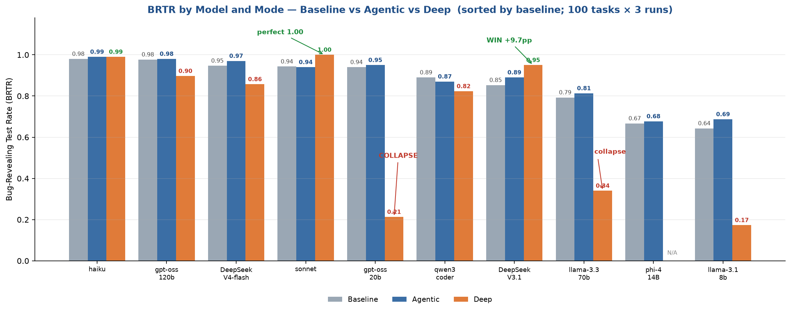

<!-- _header: "" -->
<!-- _footer: "" -->
<!-- _paginate: false -->

# TEST-AGENT
## When Does Program Analysis Help LLM Test Generation?
### An Adversarial, Cross-Model Study of Baseline vs. Agentic vs. Deep

**COM4062 Graduation Project Report**

Furkan Çağatay Özbek (21290216) · Şerafettin Tayyip Özdemir (20290357)
Advisor: Assoc. Prof. Dr. Ömer Özgür Tanrıöver
Ankara University · Faculty of Engineering · June 2026

<small>Supersedes the first-term pilot (Gemini, Jan 2026). This release reports the 100-task, 3-mode, multi-model study.</small>

---

## Contents

1. **Introduction** — Problem & Aim
2. **Literature Review** — The Evolution of Testing
3. **Material & Method** — Three Pipelines & the Oracle
4. **Experiments** — Adversarial Benchmark & Setup
5. **Results & Discussion** — The Model-Dependent Finding
6. **The Killer Contrast** — Capability ≠ Predictor
7. **Conclusion & Limitations**
8. **Future Work**
9. **References**

---

## 1. Introduction — Problem Definition

**Current success:** Tools like Copilot generate code *fast*.

**The cognitive gap — what LLMs still miss:**
- Analyzing complex / adversarial failure scenarios
- Root-cause identification across files
- **Overconfidence:** believing *100% coverage = bug-free*

> **Core problem:** A single LLM suffers from *hallucinations* and the
> *coverage illusion*. It lacks the self-reflection to verify its own tests.

<small>A test that merely runs is not a test that reveals a bug.</small>

---

## 1. Introduction — Aim of the Project

**Goal:** Build **TEST-AGENT** and answer a sharper question than "does an agent win?":

> **When — and for which models — does adding program analysis / an agentic loop
> actually improve a model's ability to write *bug-revealing* tests?**

| Investigation | Solution | Validation |
|---|---|---|
| Systematically probe LLM testing capability across the weak→strong spectrum | Compare three pipelines: **Baseline → Agentic → Deep** | Adversarial "trap" tasks + real bugs, judged by a **deterministic oracle** |

<small>Primary metric: **BRTR** (Bug-Revealing Test Rate). 100 tasks × 3 runs = 300 runs per cell.</small>

---

## 2. Literature Review — The Evolution of Testing

| Genetic Algorithms | Single LLMs | **Agentic Testing** |
|---|---|---|
| e.g. EvoSuite | e.g. Copilot | **TEST-AGENT** |
| High coverage, low readability | Simple errors, high hallucination risk | Cognitive loop, autonomous improvement |

> **Research gap:** The performance of LLMs in *adversarial (trap)* scenarios —
> and **whether the agentic loop helps or *hurts* depending on the model** —
> has not been systematically established.

<small>Our contribution: a controlled, per-model measurement of that effect.</small>

---

## 3. Method — Three Pipelines (the only variable)

The **same** TestWriter prompt, **same** retry budget, **same** deterministic
validator are used everywhere. The only thing that changes is *how much analysis
the model gets*:

| Mode | Pipeline | Idea |
|---|---|---|
| **Baseline** | Task → TestWriter → Validate | Direct generation |
| **Agentic** | Task → **Analyzer** → TestWriter → Validate | Structured analysis injected |
| **Deep** | Task → **tool-driven ReAct loop** (read_file / run_tests) → **Critic** → Validate | Agent explores the code with tools |

<small>This fairness contract isolates a single variable: the **dose of analysis**.</small>

---

## 3. Method — Agent Roles (Deep mode)

The Deep pipeline is a tool-augmented cognitive loop:

| **PLANNER** | **ANALYSIS** | **CRITIC** | **REFLECTION** | **EXECUTOR** |
|---|---|---|---|---|
| Strategy & next step | Raw data → hypotheses | Refutes claims — the *overconfidence* blocker | Continue or complete? | Acts without interpreting |

**Core principles**
1. **Agentic loop** — multi-stage cognitive cycle
2. **Blind-tool principle** — tools don't interpret; intelligence lives in the agent
3. **Deterministic orchestration** — reproducible runs

---

## 3. Method — The Bug-Revealing Oracle

A test counts as **bug-revealing** *if and only if*:

```
PASSES on the fixed (correct) code   AND   FAILS on the buggy code
```

- 100% deterministic — pytest return codes, **no LLM-as-judge**.
- Removes the "coverage illusion": a test that passes on the bug scores **zero**.
- Reported with **Wilson 95% confidence intervals** (300 runs per cell).

<small>This single predicate is the source of truth for every number in this deck.</small>

---

## 4. Experiments — Adversarial Benchmark

**Trap scenarios where standard testing fails:**

| Coverage Illusion | Indirect Causation |
|---|---|
| Logic errors survive *100%* coverage | Error in File A, root cause in File B (config) |

| **Silent Failures** | **State Dependency** |
| Swallowed exceptions / `except: pass` | Bugs that appear only in specific sequences |

<small>Tasks drawn from custom adversarial traps + **BugsInPy**, **QuixBugs**, and **HumanEvalFix** real bugs.</small>

---

## 4. Experiments — Setup & Metrics

| Dataset | Models (full 3-mode trio) | Metrics |
|---|---|---|
| 100 tasks (adversarial + BugsInPy / QuixBugs / HumanEvalFix) | **10 models, weak → strong** | **BRTR** (primary) |
| 100 × 3 runs = **300 runs / cell** | Claude **sonnet / haiku** · gpt-oss 120b/20b · qwen3-coder · DeepSeek **V3.1 / V4-flash** · llama 3.3-70b / 3.1-8b · phi-4 | Wilson 95% CI |
| Per-task isolated workspaces | each run in **all three** modes | Token cost |

> **Total: ≈ 9,000 controlled test runs** (10 models × 3 modes × 300).

<small>Every model run through the complete baseline + agentic + deep trio — the rigorous comparison set.</small>

---

## 5. Results — The Headline Table (10 models, sorted by baseline)

| Model | Baseline | Agentic | **Deep** | Δ (deep−base) |
|---|---|---|---|---|
| haiku | 0.980 | 0.990 | <span class="flat">0.990</span> | ≈ 0 (ceiling) |
| gpt-oss-120b | 0.977 | 0.980 | <span class="lose">0.897</span> | −8.0 pp |
| DeepSeek-V4-flash | 0.947 | 0.970 | <span class="flat">0.857*</span> | ≈ 0 (ceiling) |
| sonnet † | 0.943 | 0.940 | <span class="win">1.000</span> | perfect |
| gpt-oss-20b | 0.940 | 0.950 | <span class="lose">0.213</span> | **−72.7 pp** 💥 |
| qwen3-coder | 0.890 | 0.870 | <span class="lose">0.823</span> | −6.7 pp |
| **DeepSeek-V3.1** | 0.853 | 0.890 | <span class="win">0.950</span> | **+9.7 pp** ✅ |
| llama-3.3-70b | 0.793 | 0.813 | <span class="lose">0.340</span> | **−45.3 pp** 💥 |
| phi-4 (14B) | 0.667 | 0.677 | N/A** | — |
| llama-3.1-8b | 0.643 | 0.687 | <span class="lose">0.173</span> | **−47.0 pp** 💥 |

<small>† sonnet base/agentic timeout-deflated (true ≈0.99). *V4-flash ≈0.973 net. **phi-4 deep N/A (no tool-calling).</small>

---

## 5. Results — One Picture



<small>Sorted by baseline — yet **Deep ignores baseline rank**: gpt-oss-20b (0.94) crashes to 0.21 while DeepSeek-V3.1 (0.85) rises to 0.95.</small>

---

## 5. Results — Three Regimes of "Deep"

The analysis step is **not** uniformly good. It has three outcomes:

- 🟢 **Benefit** — capable *and* not yet saturated:
  **DeepSeek-V3.1** 0.853 → **0.950** (CI [91.9, 97.0] entirely above baseline
  [80.9, 88.9] → *significant*); **sonnet** deep → **1.000** (perfect).

- 🟡 **Ceiling / neutral** — already near the top:
  **haiku** (≈0.99 in all three), **DeepSeek-V4-flash** (0.947 → ≈ baseline).
  ~5× the tokens, no BRTR gain.

- 🔴 **Collapse / harm** — weak or tool-clumsy:
  **gpt-oss-20b** (0.213), **llama-3.1-8b** (0.173), **llama-3.3-70b** (0.340);
  milder harm for **gpt-oss-120b** (0.98→0.90) and **qwen** (0.89→0.82).

---

## 6. The Killer Contrast — Capability ≠ Predictor

Two models with **almost the same baseline**, opposite deep outcome:

| | Baseline | **Deep** | Outcome |
|---|---|---|---|
| **DeepSeek-V3.1** | 0.853 | <span class="win">0.950</span> | **climbs +9.7 pp** |
| **llama-3.3-70b** | 0.793 | <span class="lose">0.340</span> | **collapses −45.3 pp** |

> Baseline capacity does **not** predict the deep result.
> The 70B model is *large* yet collapses; the Llama family collapses at **both**
> 8B (−47 pp) and 70B (−45 pp).

**The real predictor is agentic / tool-driving skill** — DeepSeek drives the
loop competently; Llama calls the tools but cannot follow the protocol.

---

## 6. Same Family, the "Headroom" Rule

Within one vendor family, the deep gain is governed by **how much room is left**:

| DeepSeek | Baseline | Deep | Δ |
|---|---|---|---|
| **V3.1** (has headroom) | 0.853 | 0.950 | **+9.7 pp** ✅ |
| **V4-flash** (near ceiling) | 0.947 | 0.857–0.973 | **≈ 0 (neutral)** |

Both drive the agentic loop well; the difference is purely **headroom**.
→ Analysis pays off only when the model is **both** unsaturated **and**
agentically competent.

---

## 6. (Latest) A Fourth Architecture — Scout-Writer

If the collapse is the *dual burden* (drive tools **and** write the test in one
loop), **separating** them should rescue the model:

- **Scout phase:** the model drives the tool loop to produce an *analysis only*.
- **Writer phase:** a fresh, tool-free context writes the test from that analysis.

| gpt-oss-20b | Deep (one loop) | **Scout-Writer** |
|---|---|---|
| BRTR | <span class="lose">0.213</span> | <span class="win">0.897</span> |

> Decoupling **repairs** the collapse (+68 pp) → the collapse was the *dual
> burden*, **not** the model's capability. (Neutral at the ceiling: Claude
> Haiku 0.987 / Sonnet 0.990.)

---

## 7. Conclusion

**Achievements**
- A controlled, ≈9,000-run, 10-model measurement of *when* analysis helps.
- **Positive result:** for a capable-but-unsaturated model (DeepSeek-V3.1),
  deep gives a **statistically significant** +9.7 pp.
- **Novel finding:** the deep outcome is predicted by **agentic skill, not raw
  capability** (V3.1 wins ↔ llama-3.3-70b collapses at the same baseline).
- A deterministic, no-judge oracle (BRTR + Wilson CI).

**Limitations (honest)**
- Deep is **double-edged**: it can *collapse* weak / tool-clumsy models.
- Cost: deep uses **~10–15× more tokens** and is far slower than baseline.

---

## 8. Future Work

| Decouple | Route | Extend |
|---|---|---|
| **Scout-Writer** as a first-class mode — rescue the collapse band | **Capability-aware routing** — give deep only to models that gain from it | Beyond Python (Java, TypeScript); self-healing (test → fix) |

> Target the architecture at **low-baseline + tool-clumsy** models, where
> decoupling can convert the wasted deep budget into a real gain.

---

## 9. References

- Yao, S. et al. (2022). *ReAct: Synergizing Reasoning and Acting in LMs.*
- Yang, J. et al. (2024). *SWE-agent: Agent-Computer Interfaces.*
- Jimenez, C. E. et al. (2024). *SWE-bench.*
- Widyasari, R. et al. (2020). *BugsInPy.*
- Gu, S. et al. (2025). *LLM Test Generation via Iterative Hybrid Program Analysis.*
- Wu, Q. et al. (2023). *AutoGen: Multi-Agent Conversation.*
- Schäfer, M. et al. (2024). *Empirical Evaluation of LLMs for Unit Test Generation.*

---

<!-- _header: "" -->
<!-- _footer: "" -->
<!-- _paginate: false -->

# Thank You

**Ankara University · Computer Engineering**

Furkan Çağatay Özbek · Şerafettin Tayyip Özdemir
Advisor: Assoc. Prof. Dr. Ömer Özgür Tanrıöver

<small>Questions welcome.</small>
