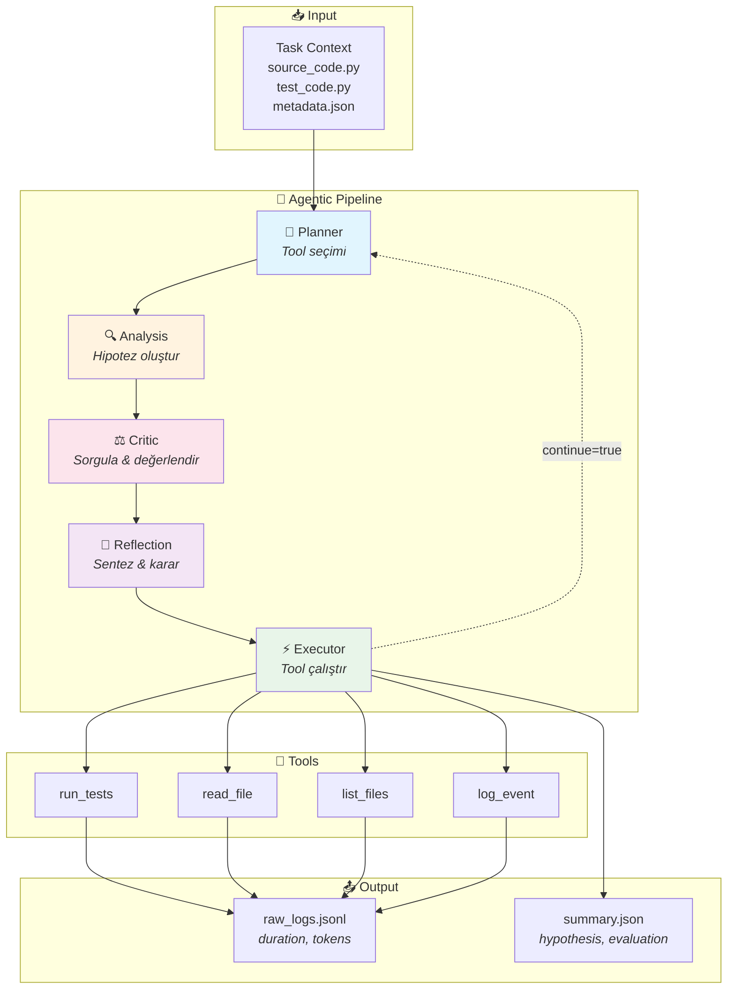
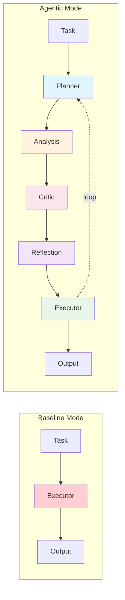

# Test-Agent: Multi-Agent Bug Detection Framework

LLM tabanlı çok-ajanlı bir hata tespit sistemi. Baseline (tek LLM) ve Agentic (çok-ajanlı pipeline) modlarını karşılaştırarak LLM'lerin yazılım hatalarını bulma yeteneklerini değerlendirir.

## 🎯 Proje Amacı

Bu framework, adversarial test senaryolarında LLM'lerin hata tespit performansını ölçer:

- **Baseline**: Tek bir LLM executor ile doğrudan tool çağrısı
- **Agentic**: 5 ajanlı pipeline (Planner → Analysis → Critic → Reflection → Executor)

## 📊 Test Sonuçları

| Task                | Baseline | Agentic  |
| ------------------- | -------- | -------- |
| misleading_coverage | 1/10 ❌  | 10/10 ✅ |
| state_dependent_bug | 1/10 ❌  | 10/10 ✅ |
| indirect_cause      | 1/10 ❌  | 10/10 ✅ |
| **Ortalama**        | **10%**  | **100%** |

## 🏗️ Mimari

```
┌─────────────┐     ┌──────────────┐     ┌─────────┐     ┌────────────┐     ┌──────────┐
│   Planner   │ ──▶ │   Analysis   │ ──▶ │  Critic │ ──▶ │ Reflection │ ──▶ │ Executor │
└─────────────┘     └──────────────┘     └─────────┘     └────────────┘     └──────────┘
       │                   │                  │                 │                 │
       └───────────────────┴──────────────────┴─────────────────┴─────────────────┘
                                    Context Passing
```

### Mermaid Diagram



### Baseline vs Agentic



### Agent Rolleri

| Agent          | Görev                                                  |
| -------------- | ------------------------------------------------------ |
| **Planner**    | Sonraki adımı planla, hangi tool çağrılacağını belirle |
| **Analysis**   | Hipotez oluştur, kanıtları değerlendir (JSON mode)     |
| **Critic**     | Hipotezi sorgula, alternatifler sun                    |
| **Reflection** | Tartışmayı sentezle, devam/dur kararı ver              |
| **Executor**   | Tool'u çalıştır, sonuçları raporla                     |

## 📁 Dosya Yapısı

```
Test-agent/
├── main.py                  # CLI entry point
├── config.yaml              # Model konfigürasyonu
├── custom_session.py        # Ana orchestrator
├── llm_client.py            # Gemini API client
├── agents/
│   └── agent_graph.yaml     # Agent wiring tanımları
├── prompts/
│   ├── planner.txt
│   ├── analysis.txt
│   ├── critic.txt
│   ├── reflection.txt
│   └── executor.txt
├── evaluation/
│   ├── run_all.py           # Toplu test runner
│   ├── evaluator.py         # LLM-based değerlendirme
│   └── tasks/               # Adversarial test senaryoları
│       ├── misleading_coverage/
│       ├── state_dependent_bug/
│       └── indirect_cause/
├── schemas/                 # Pydantic modelleri
├── tools/                   # Blind tool implementasyonları
└── runs/                    # Test çıktıları
```

## 🚀 Kurulum

### 1. Bağımlılıkları yükle

```bash
pip install -r requirements.txt
```

### 2. API anahtarını ayarla

`.env` dosyası oluştur:

```bash
GOOGLE_API_KEY=your_api_key_here
```

### 3. Environment'ı yükle

```bash
source .env
# veya
set -a && source .env && set +a
```

## 💻 Kullanım

### Tek Task Çalıştırma

```bash
# Agentic mode
python3 main.py --task misleading_coverage --run-id test1 --mode agentic

# Baseline mode
python3 main.py --task misleading_coverage --run-id test1 --mode baseline
```

### Tüm Task'ları Çalıştırma

```bash
# Tüm task'ları her iki modda çalıştır
python3 evaluation/run_all.py --mode both

# Sadece agentic
python3 evaluation/run_all.py --mode agentic

# LLM değerlendirmesi ile
python3 evaluation/run_all.py --mode both --evaluate
```

### Çıktılar

Her run şu dosyaları üretir:

- `runs/<task>/<run_id>/raw_logs.jsonl` - Detaylı JSONL logları
- `runs/<task>/<run_id>/summary.json` - Özet ve hipotez

## 🧪 Adversarial Test Senaryoları

### 1. Misleading Coverage

%100 test coverage ama VIP+quantity kombinasyonu test edilmemiş. Overwrite bug gizli kalıyor.

### 2. State Dependent Bug

`logout()` sonrası state sıfırlanmıyor. Stale data hatası.

### 3. Indirect Cause

`Config.timeout_ms=0` kök sebep, hata üst katmanda görünüyor.

## 📈 Log Formatı

Her log entry şu alanları içerir:

```json
{
  "timestamp": "2026-01-01T13:47:26Z",
  "agent": "planner",
  "role": "assistant",
  "content": "TOOL: run_tests...",
  "duration_seconds": 9.497,
  "token_usage": {
    "prompt_tokens": 969,
    "completion_tokens": 75,
    "total_tokens": 1963
  }
}
```

## 🔧 Konfigürasyon

### config.yaml

```yaml
model_id: gemini-2.5-pro
max_turns: 64
timeout_seconds: 900
```

### agent_graph.yaml

```yaml
modes:
  baseline:
    agents: [executor]
  agentic:
    agents: [planner, analysis, critic, reflection, executor]
```

## 🛠️ Available Tools

| Tool               | Açıklama          | Args                                                   |
| ------------------ | ----------------- | ------------------------------------------------------ |
| `run_tests`        | pytest çalıştır   | `{}`                                                   |
| `read_file`        | Dosya oku         | `{"path": "<filepath>"}`                               |
| `read_file_window` | Satır aralığı oku | `{"path": "<filepath>", "start": <int>, "end": <int>}` |
| `list_files`       | Dizin listele     | `{"path": "<dirpath>"}`                                |
| `log_event`        | Gözlem logla      | `{"message": "<text>"}`                                |

## 📝 Notlar

- **DeepAgents**: Non-terminating loop sorunu nedeniyle kullanılmıyor. Detaylar: `docs/deepagents_failure.md`
- **JSON Mode**: Analysis agent yapılandırılmış output için Gemini JSON mode kullanıyor
- **Context Passing**: Agent'lar arası bilgi aktarımı `ConversationHistory` class ile sağlanıyor

## 📄 Lisans

MIT

---

_Son güncelleme: 1 Ocak 2026_
